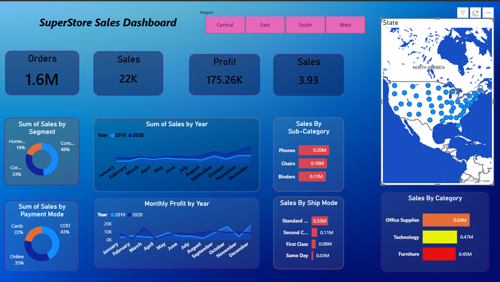
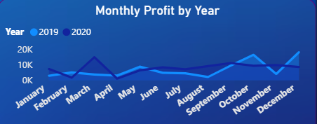
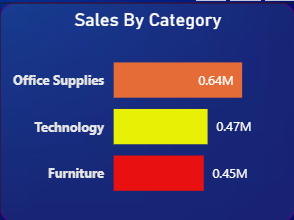
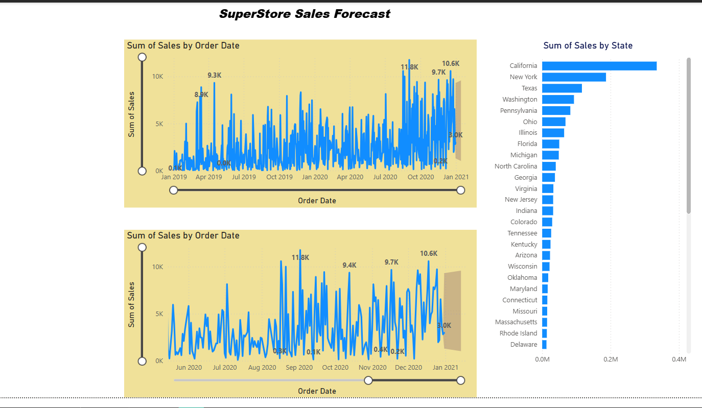

# Superstore-sales-analysis
This project analyzes Superstore sales data to uncover key drivers of revenue, profit, and loss across regions, categories, and customer segments. The objective was to move beyond basic visualization and perform deep business analysis, identifying inefficiencies such as high discount-driven losses, underperforming product categories, and regional profitability gaps.

Through interactive dashboards and exploratory analysis, the project highlights critical insights including profit leakage areas, top-performing segments, and seasonal sales patterns. It also provides actionable recommendations such as optimizing discount strategies, focusing on high-margin products, and improving performance in low-profit regions.

## Objectives : 
- Analyze sales and profit performance
- Identify loss-making areas
- Understand impact of discounts on profit
- Discover top-performing products and regions
- Provide business recommendations

## 📊 Dashboard Preview

### Full Dashboard

### Profit by Year

### Sales by Category

### Sales Forecast

## 🔍 Key Insights

- High discounts significantly reduce profit margins
- Furniture category shows consistent losses
- Technology category drives highest profitability
- A small number of products contribute majority of revenue

## Tools Used : 
-Power BI
-Ms-Excel

